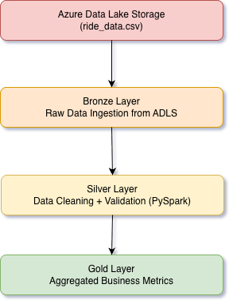
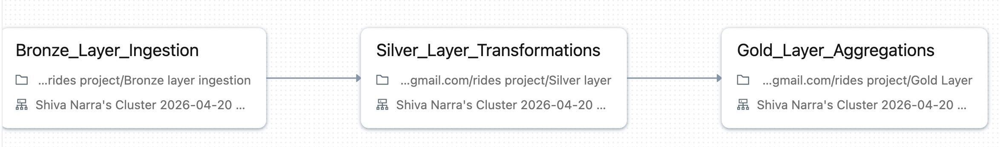

# Ride Analytics Pipeline (Medallion Architecture)

## Overview
End-to-end data pipeline built using Azure Databricks and Delta Lake.  
Processes ride data through Bronze, Silver, and Gold layers to generate business insights.

## Data

This project uses a simulated ride dataset stored in the `data/` folder.

The dataset contains ride-level events including:
- user_id
- driver_id
- event_type
- fare_amount
- timestamp

## Architecture

## Tech Stack
- Azure Data Lake Storage
- Databricks (PySpark)
- Delta Lake
- Unity Catalog
- Databricks Workflows (Jobs)

## Pipeline

### Bronze
- Raw ingestion from ADLS

### Silver
- Null removal
- Deduplication
- Data validation

### Gold
- Daily revenue metrics
- Ride counts
- City demand analysis

## Orchestration
- Databricks Job with task dependencies
- Email notifications on success/failure

## Output Tables
- gold.daily_metrics
- gold.city_metrics
